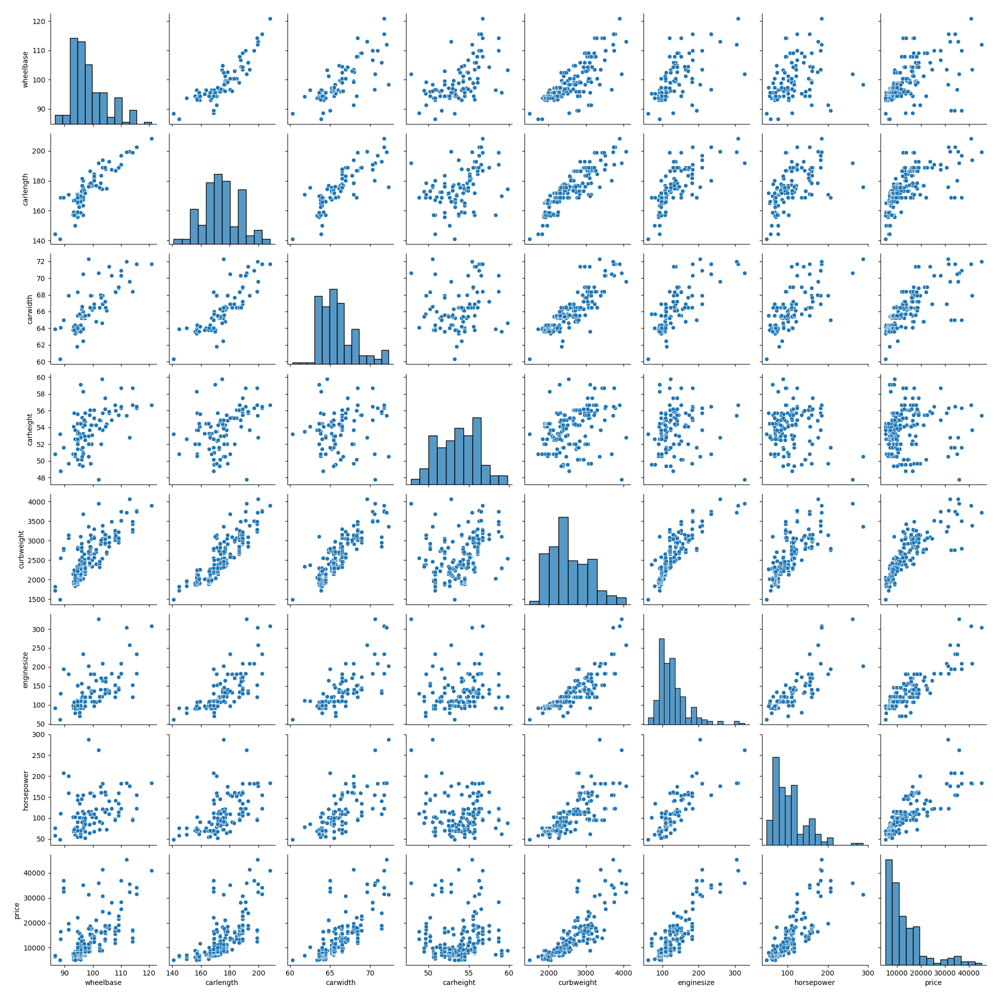
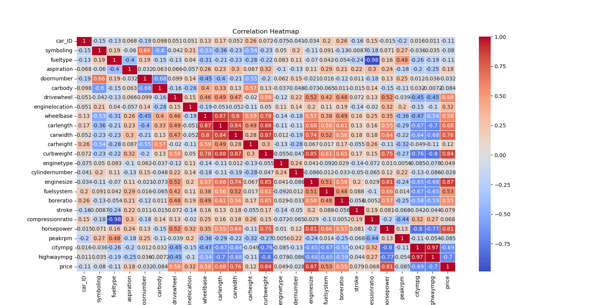
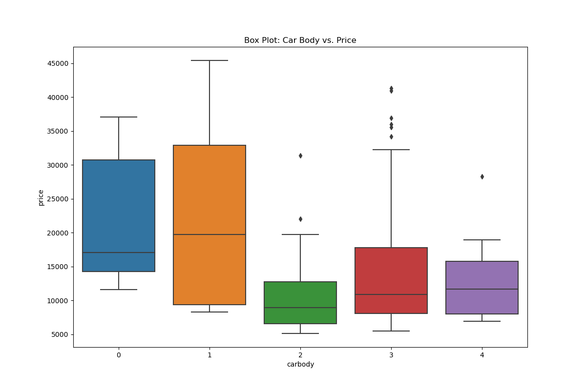
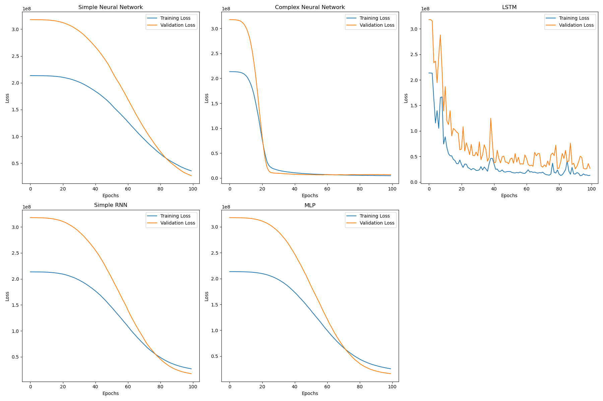
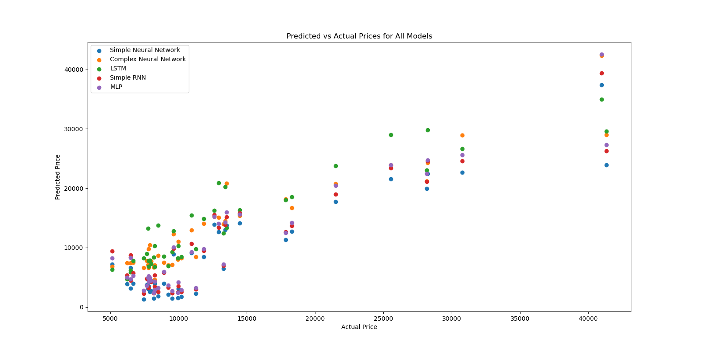
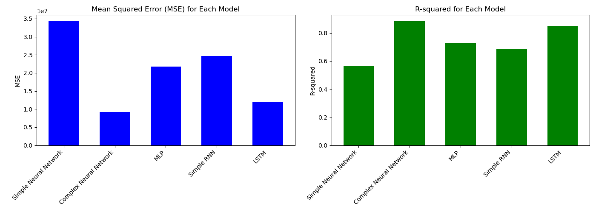

# Car Price Prediction using Deep Learning

This project predicts car prices using deep learning. The dataset contains both categorical and numerical car features. The notebook compares several models using mean squared error and R-squared.

## Table of Contents

- Installation
- Usage
- Visualizations
- Model
- Results
- Conclusions

## Installation

Use Python 3.11 or newer. From the repository root, create and activate a virtual environment, then install the web app dependencies:

```bash
python -m venv .venv
# Windows PowerShell:
.\.venv\Scripts\Activate.ps1
# macOS/Linux:
source .venv/bin/activate
pip install -r requirements.txt
```

To run the web app locally:

```bash
streamlit run streamlit_app.py
```

To run the deep-learning notebook instead, install its additional dependencies and start JupyterLab:

```bash
pip install -r requirements-notebook.txt
jupyter lab
```

Open `Model/Car_Price_Prediction_with_DL.ipynb` and run the cells in order. Charts are saved in `Images/` and trained models are saved in `Model/`.

## Deploy the web app

The app can be hosted for free on [Streamlit Community Cloud](https://share.streamlit.io/):

1. Push the repository to GitHub.
2. Sign in to Streamlit Community Cloud with GitHub and select **Create app**.
3. Choose this repository, the `main` branch, and `streamlit_app.py` as the app file, then deploy.

The root `requirements.txt` contains only the web app dependencies, so the deployment does not need to install TensorFlow or JupyterLab. The dashboard trains and caches a scikit-learn prediction pipeline from the included dataset, then shows the estimate and interactive charts together. The notebook's deep-learning models remain available separately.

## Visualizations

### This project includes several visualizations to understand the data better:

#### Pair plot for numerical features



Correlation heatmap


Box plot for car body vs. price


Interactive 3D scatter plot for curb weight, horsepower, and price


Training History Plot
 

Predicted vs Actual Price Scatter Plot


## Model
Different DL models were used to predict the car prices, then the best one was chosen.

Simple Neural Network:

Architecture: One input layer, one hidden layer with 64 neurons and ReLU activation, one hidden layer with 32 neurons and ReLU activation, and one output layer with linear activation.
Compilation: Adam optimizer, mean squared error loss function.

Complex Neural Network:

Architecture: One input layer, one hidden layer with 128 neurons and ReLU activation, one hidden layer with 64 neurons and ReLU activation, one hidden layer with 32 neurons and ReLU activation, and one output layer with linear activation.
Compilation: Adam optimizer, mean squared error loss function.

Simple RNN (Recurrent Neural Network):

Architecture: A SimpleRNN layer with 64 units, a dense layer with 32 ReLU units, and a linear output layer. The feature vector is reshaped into a sequence for the recurrent layer.
Compilation: Adam optimizer, mean squared error loss function.

MLP (Multi-Layer Perceptron):

Architecture: One input layer, one hidden layer with 64 neurons and ReLU activation, one hidden layer with 32 neurons and ReLU activation, and one output layer with linear activation.
Compilation: Adam optimizer, mean squared error loss function.

LSTM (Long Short-Term Memory):

Architecture: An LSTM layer with 64 units and a linear output layer.
Compilation: Adam optimizer, mean squared error loss function.

## Results

| Model                   | MSE                     | R-squared              |
|-------------------------|-------------------------|------------------------|
| Simple Neural Network   | 34290440.002507746     | 0.5656360086499759     |
| Complex Neural Network  | 9222450.53118023        | 0.883177339734963      |
| MLP                     | 21686974.238817435      | 0.7252866778615561     |
| Simple RNN              | 24707967.891473647      | 0.6870191356336094     |
| LSTM                    | 11925410.305463398      | 0.8489383974545393     |


## Conclusions
As the results show, based on the lowest MSE or Higest R-Squared value, Complex Neural Network is the best model.

Error Values Comparison Bar Plot
